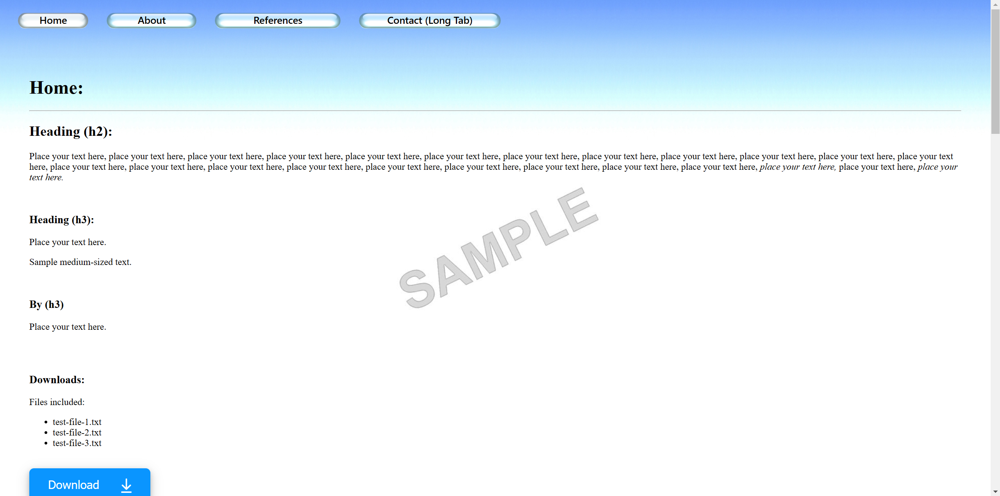

# A simple free HTML website template for hosting on GitHub and elsewhere:

## Click on the link below to open and try out the template.

* [Click this link to visit and try the website being created from this repository and hosted on github-pages.](https://boxbot6.github.io/simple-website-template-sky-style-v1/)

## To copy and use the template:
* Create a new folder on your computer and name it - this folder will be your new websites root directory folder.
* Use the green '\<\> Code' button at the top of this repository's github page to 'Download ZIP' of this repository.
* Unzip the download and copy the internal contents to the new folder keeping all its subfolders intact.
* This folder now contains your new website ready to be personalised by editing the contents as outlined in the section below and when you are happy with the results you can host it for free on GitHub (as shown further down on this page) or simply move the complete new root directory folder to wherever else you wish to host it.

## To edit your new website:
* Open the index.html file from your new folder (using Notepad or another html editor) and edit the contents to create your own home page (A good beginners guide here: [HTML For Beginners The Easy Way: Start Learning HTML & CSS Today](https://html.com/)).
* (To test the website while you are editing - save changes and then click on the index.html and a browser window will open and display the results of your current edits - refresh the browser tab after saving any further edits to display subsequent changes).
* Update \<title\> with your own info.
* Put any images you want to use into the images folder and link to them in the index.html by copying how its done for the demo images.
* Duplicate, add or remove elements that you want and reposition them on the page to suit your own purposes.
* If you are new to coding the header tabs might look a little complicated at first because they contain options for displaying different images dependant on if you are hovering over them, clicking on them or currently viewing that particular page etc. (as well as having different demo sizes for the tabs) - just rename or duplicate the existing ones for ease until you are comfortable with how they work (all the icons for the tabs are stored in images).
* Update any other elements\/text on the page as required including the footer and then check that all the links are working (see the links already included in the template for examples).
* Edit the .css file to change the website presentation and styles.
* Delete or \<\!\-\- comment out \-\-\> anything not needed.
* Add any new pages you want by studying and copying the way the code is used for the existing pages (or just rename the existing pages and tabs to what you want).
* Edit the index.html files for the other pages including any new pages you have created (every page should have an index.html that is located in their own subdirectory folder) - add your own content to each of these subsequent pages as you did for the home page.
* When you are happy with everything host it on GitHub as below, upload it to a hosting service or move the main root directory folder to the location where you wish to host it from your own server.

## Using free github hosting:
GitHub Pages is designed to host your personal, organization, or project pages from a GitHub repository (Size\/usage limits apply: sites may be no larger than 1 GB with a soft bandwidth limit of 100 GB per month).

### github repository bit:
* Sign in to your account on [Github.com](https://github.com/), go to 'Your repositories' and select 'New' (top right).
* In 'create a new repository' give the new repository a name (this name will also apply to your website), add an optional description, keep check box 'Public' to make your repository and website created from it visible online to the general public. (don't add a README file, .gitignore or Licence here, the relevant files will be added later).
* Press 'Create repository' at the bottom.
* This will take you to Quick setup, select 'uploading an existing file'
* On the next page drag and drop all the files and folders together as a bundle from inside the new root directory folder that you made earlier in 'To copy and use the template' onto the upload section.
* Press 'Commit changes' at the bottom
* After creating the repository double-check that it is listed as Public (if not change the visibility in settings).
* Change the Licence etc. at this time if you want to.
### github-pages bit:
* Now use 'Settings' to open GitHub Pages (shown as Pages in the column on the left).
* Select Source - Deploy from a branch, select main, then save.
* Wait a few minutes for the website to be created and become active - when its done the https address will be shown in github-pages - copy the link and you can use it in the option below to replace this README.md file with a simpler one that displays just the name and description of your own website and contains the link to that new site.

 

Example of a simple README.md file to replace this one:

---

# HTML Website Hosting For:

### put-your-website-name-here

 

* [Click this link to visit the website being created from this repository by github-pages.](https://put-your-github-name-here.github.io/put-your-website-name-here/)

 

(After creating your own website you can edit this README.md to show your own sites name above and update the https link beneath it to take you to your new websites address (find the link in github-pages)). - You can then write your own description here and if you want add an image to help visitors quickly see what your site looks like - you can then delete this comment!)

---

 

Code for the above example: (replace the text in your repository's README.md with this).

      # HTML Website Hosting For:

      ### put-your-website-name-here

       

      * [Click this link to visit the website being created from this repository by github-pages.](https://put-your-github-name-here.github.io/put-your-website-name-here/)

       

      (After creating your own website you can edit this README.md to show your own sites name above and update the https link beneath it to take you to your new websites address (find the link in github-pages)). - You can then write your own description here and if you want add an image to help visitors quickly see what your site looks like - you can then delete this comment!)
      
 

 

You can now share or embed the link to your newly created GitHub Pages site wherever you like (the link can be found in your GitHub repository under Settings > Pages). This link can also be copied into a search bar for anyone to visit the site.

 

 

**Update:** If you are having trouble getting your site to appear in google search results:

You may have to wait a day or so for your original GitHub repository to show up in google searches but unfortunately the new github-pages website that you just created (https<nolink>://yourname.<ins>github.io</ins>/yoursitename/) may not be indexed for many days or even weeks after you create it - there are many different remedies on the internet explaining how to get google to index your website quicker - here are a few pointers:
* Go to [google search console](https://search.google.com/search-console/about) to verify your site (you will need to sign in with your google account). There are various ways to add your new property and verify your website, but the easiest is probably to enter the URL of your github-pages site, download a google verification file and then put it in the main directory of your repository, then after waiting a couple of minutes for github-pages to refresh after the addition of the new file and become live again verify it in google search console).
* Add a sitemap.xml to the main directory of your repository to encourage google to index your site if it is crawled (a sitemap is a simple text file to tell search engines about the layout of your site - copy and amend a sitemap.xml from one my other example sites with the info from your site (it's just a text file and can be edited in notepad)).
* After adding the sitemap.xml to your repository you can also add the sitemaps location to google search console (Google Search Console > Indexing > Sitemaps > Add a new sitemap).
* Images may take even longer to be indexed because a different slower googlebot is used for image crawling (you can try also including the images in the sitemap to help).
* **Please note:** Probably the best thing you can do to get indexed quickly is to make lots of links from other websites that lead to your site so it can be easily accessed in many different ways by the bots.

 

Click the link below to visit the website being created from this repository by github-pages.

[https://boxbot6.github.io/simple-website-template-sky-style-v1/](https://boxbot6.github.io/simple-website-template-sky-style-v1/)

 

---

* [Click this link to see more templates.](https://boxbot6.github.io/simple-website-templates/)

 

